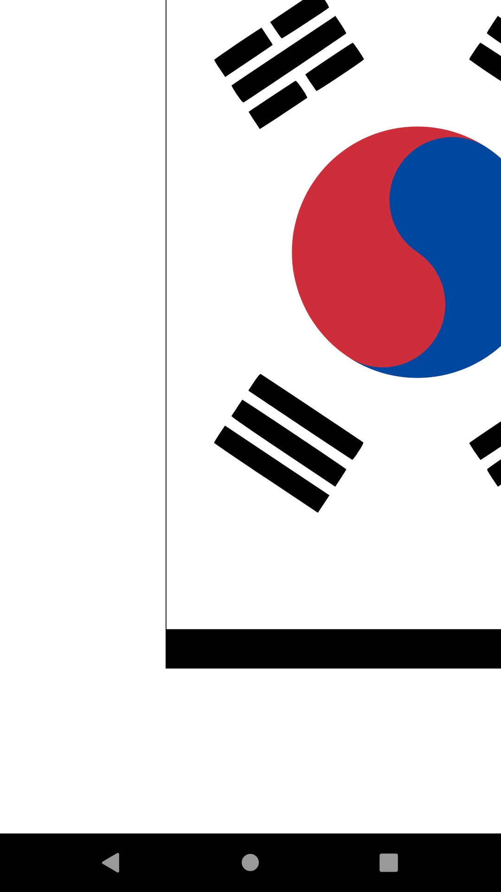
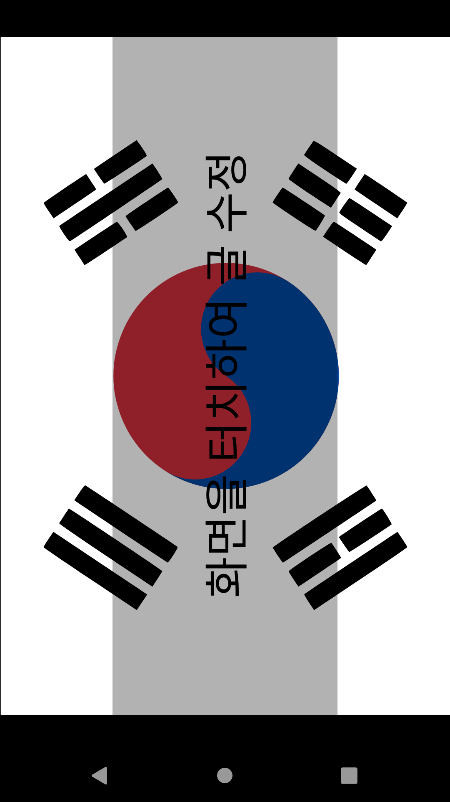
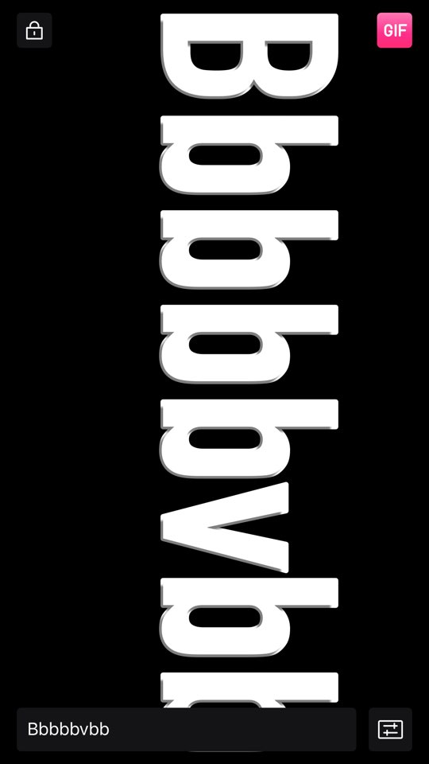
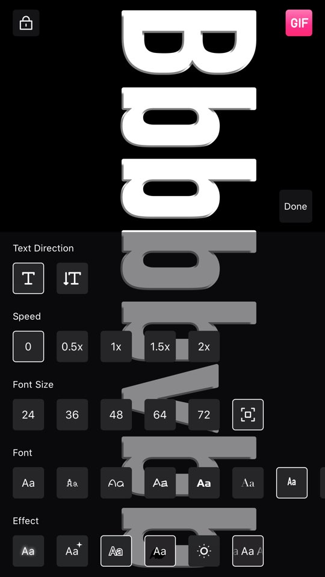
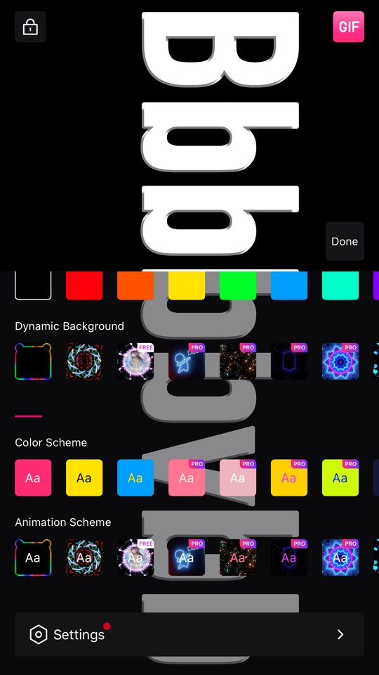
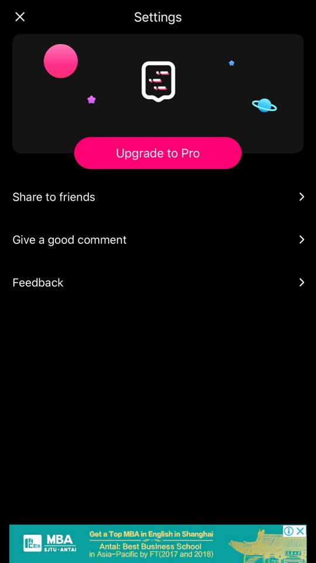

# 앱 시연

계획 수행 결과

# 1차 목표 - 태극기 이미지 띄우기
세로로 띄우는데 성공


## 이걸 가로로 돌려서 보여주려면?
### 1) 기기 Orientation을 감지해서 화면 돌리기
보류 - UX측면에서 마음에 안들어서

### 2) 컴포넌트를 회전
```
style={{
  transform: [
    { rotateZ: '-90deg' },
  ],
}}
```
이상하게 보인다


#### [How to layout rotated text in React Native - Maarten Schumacher - Medium] (https://medium.com/@therealmaarten/how-to-layout-rotated-text-in-react-native-6d55b7d71ca5)

OFFSET 값을 추가로 더하고 빼서 해결


# 2차 목표 - 텍스트 입력을 위한 UI 구성
## 참고 앱 - led banner





## 라이브러리 활용
깃헙 & npmjs에서 키워드 검색 하여 
- 스타 수
- 다운로드 수 
- 업데이트 일자

등을 바탕으로 선택

### 1) bottom sheet 컴포넌트 활용
Modal 컴포넌트를 바탕으로 제작된 React Native용 라이브러리

### 2) 텍스트 자동으로 스크롤링
Animated 컴포넌트를 바탕으로 제작된 React Native용 라이브러리

### 3) 화면 제어
앱 실행 중 지속해서 화면을 켜두기 위한 라이브러리

# 3차 목표 - 국기 변경 기능
## svg flagkit 라이브러리 활용
[jackmew/react-native-svg-flagkit: SVG flag for react-native] (https://github.com/jackmew/react-native-svg-flagkit)

일부 국가의 국기가 제대로 표현되지 않는다.

Svg generator 사이트에서 주요 국가 국기 수정 작업 진행 예정
[Playground - SVGR] (https://www.smooth-code.com/open-source/svgr/playground/)

# 4차 목표 - 출시 준비
## 안드로이드 등록 가이드
[카탈로그 : Academy for App Success] (https://playacademy.exceedlms.com)

동영상 및 텍스트 가이드가 잘 정리되어있다
## firebase 라이브러리 추가
[Introduction | React Native Firebase | Invertase] (https://invertase.io/oss/react-native-firebase/)

[React Native - react-native(RN)를 사용하여 어플리케이션을 제작한 기록입니다. react-native와 관련 라이브러리를 어떻게 활용하는지에 대해 공유합니다.] (https://dev-yakuza.github.io/ko/react-native/)
### analytics
### admob
### crashlytics

공식 홈페이지 가이드라인 위주로 설정하니 자동으로 파이어베이스 앱 초기화가 적용 됨

## 앱 아이콘 제작


## 개인정보처리방침
깃헙 페이지로 구현 예정

# 후기

[[SNS눈] 손흥민 선전에 때아닌 ‘태극기 논란’…응원 기준 두고 시끌] (https://www.hankookilbo.com/News/Read/201912081950318023)

이제는 실물 태극기 대신 모바일 태극기를 들고 응원하는 관중을 볼 수 있을 것으로 기대된다.